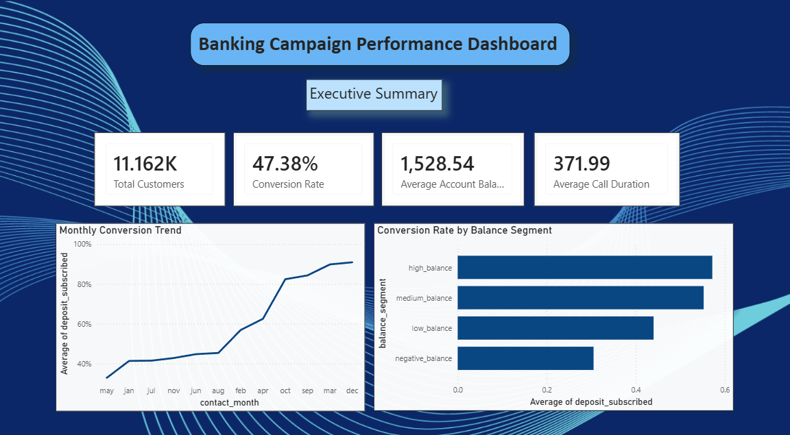
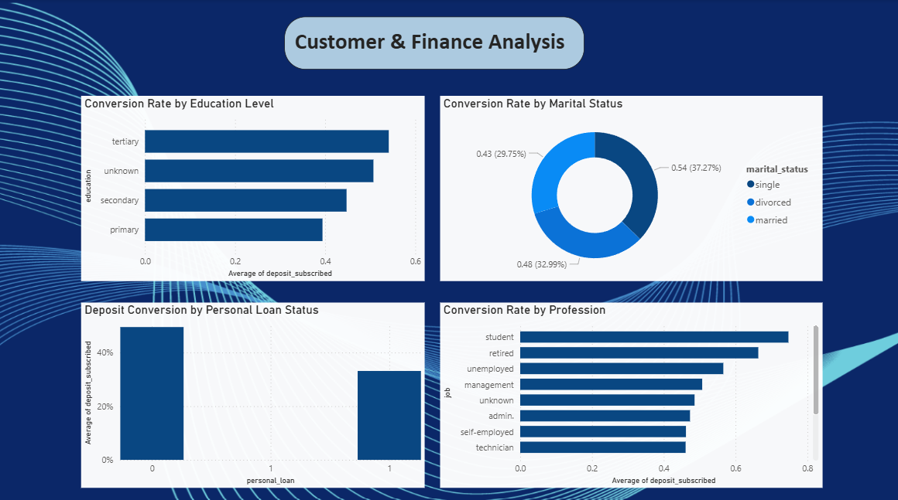
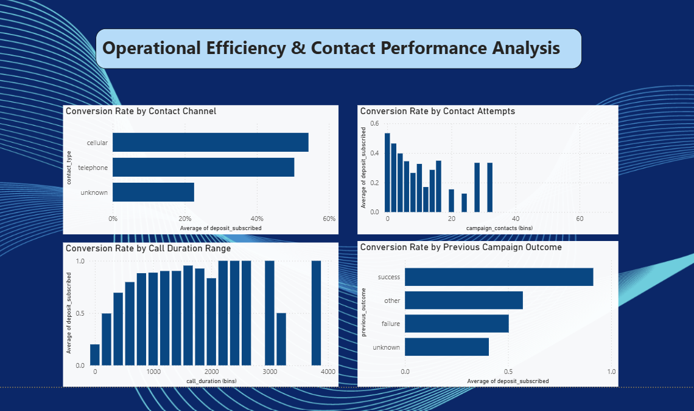

# 📊 Banking Campaign Performance Dashboard

## 📌 Project Overview

This project analyzes a banking marketing campaign dataset using SQL and Power BI to identify customer conversion behavior, campaign effectiveness, and operational performance trends.

The dashboard provides insights into:

- Customer conversion trends
- Financial segment performance
- Marketing campaign effectiveness
- Contact channel efficiency
- Customer demographic behavior

---

# ❓ Business Questions Answered

## Executive Summary

- What is the overall campaign conversion rate?
- How many customers were contacted?
- Which balance segment has the highest conversion rate?
- How does conversion change across months?

## Customer & Finance Analysis

- Which education level converts the most?
- Does marital status impact subscription behavior?
- How do personal loans affect conversion?
- Which professions show higher conversion rates?

## Operational Efficiency & Contact Performance Analysis

- Which contact channel performs better?
- How does the number of contact attempts impact conversion?
- Does longer call duration improve conversion rates?
- How does previous campaign outcome influence future conversions?

---

# 🛠️ Tools & Technologies Used

- SQL
- Power BI
- CSV Dataset Processing
- GitHub

---

# 🧠 SQL Analysis

SQL was used for:

- Data cleaning
- Customer segmentation
- KPI generation
- Conversion analysis
- Aggregation and reporting

SQL queries are available in:

```text
sql/banking_analysis_queries.sql
```

---

# 📁 Project Structure

```text
banking-campaign-performance-dashboard/
│
├── dashboard/
│   └── banking_campaign_dashboard.pbix
│
├── data/
│   ├── raw/
│   │   └── bank.csv
│   │
│   └── processed/
│       └── final_banking_report.csv
│
├── images/
│   ├── page1.png
│   ├── page2.png
│   └── page3.png
│
├── sql/
│   └── banking_analysis_queries.sql
│
└── README.md
```

---

# 📈 Dashboard Pages

# 1️⃣ Executive Summary

This page provides high-level campaign KPIs and trend analysis.

### Key Metrics:

- Total Customers
- Conversion Rate
- Average Account Balance
- Average Call Duration

### Visual Insights:

- Monthly Conversion Trend
- Conversion by Balance Segment



---

# 2️⃣ Customer & Finance Analysis

This page focuses on customer demographics and financial characteristics.

### Visual Insights:

- Conversion Rate by Education Level
- Conversion Rate by Marital Status
- Conversion by Personal Loan Status
- Conversion Rate by Profession



---

# 3️⃣ Operational Efficiency & Contact Performance Analysis

This page analyzes operational campaign performance.

### Visual Insights:

- Conversion Rate by Contact Channel
- Conversion Rate by Contact Attempts
- Conversion Rate by Call Duration Range
- Conversion Rate by Previous Campaign Outcome



---

# 🔍 Key Insights

- Customers with higher account balances showed stronger conversion rates.
- Cellular contact channels performed better than telephone campaigns.
- Successful previous campaign outcomes significantly increased future conversion probability.
- Longer call durations generally correlated with higher conversion rates.
- Students and retired customers showed relatively stronger conversion performance.

---

# 🔄 Data Processing Workflow

1. Imported raw banking dataset into SQL
2. Performed data cleaning and preprocessing
3. Created customer segments and analytical tables
4. Exported transformed dataset for reporting
5. Built interactive Power BI dashboard

---

# 🚀 How to Use

1. Download the `.pbix` file from the `dashboard/` folder
2. Open using Power BI Desktop
3. Explore interactive dashboard visuals and filters

---

# 👨‍💻 Author

**Devarun Bharadwaj**

- MSc Molecular & Cellular Biology
- Transitioning into Data Analytics
- Skilled in SQL, Power BI, Excel, and Data Visualization
